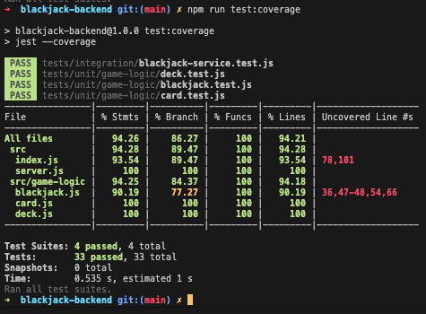

# Blackjack backend

This project is a backend service designed to provide a seamless and interactive Blackjack game experience through a RESTful API, built with Express.js. The API supports the core functionalities required to play Blackjack, also known as 21, one of the most popular casino banking games globally. The service is structured to handle game sessions, player actions, and to deliver game status updates in real-time.

## Features

**Game Initialization:** Start a new game of Blackjack with the /blackjack/start endpoint. This initializes a new game session and deals the initial cards to both the player and the dealer.

Game Status: The /blackjack/status endpoint provides the current status of the game, including both the player's and the dealer's hands, with the dealer's second card hidden unless the game has concluded.

Player Actions: Players can take actions such as "hit" (requesting an additional card) or "stand" (holding their current total and ending their turn) through respective endpoints. These actions are processed in real-time, and the game state is updated accordingly.

Error Handling: The service includes error handling for scenarios such as requesting actions without an active game or attempting invalid game moves, ensuring a robust gaming experience.

## Technology Stack

Express.js: Utilized for its minimalistic, flexible, and scalable structure, making it a perfect choice for creating a lightweight RESTful API.

CORS Middleware: Configured to allow requests from specific origins, ensuring the API can be securely accessed from web applications hosted on different domains.

## How it works?

The backend service uses an object-oriented approach to manage the game logic. A Blackjack class encapsulates the rules and state of the game, handling card dealing, scoring, and the determination of game outcomes. The Express.js framework facilitates the API layer, mapping HTTP requests to game actions and responses.

Through a series of endpoints, the API exposes functionality to start a new game, perform player actions like "hit" and "stand", and query the current game status. This structure allows for easy integration with frontend applications, providing a complete Blackjack gaming experience.

## Installation

Before installing, make sure you have [Node.js](https://nodejs.org/) installed. (v20.0.0+)


### Getting Started

install dependencies
```npm install```

start the server
```npm run dev```

### Environment Configuration

PORT: The port on which your server will run (default is 3000).

### API Endpoints

Here's a list of available API endpoints:

- POST /blackjack/start: Start a new Blackjack game. "curl --location --request POST 'http://localhost:3000/blackjack/start'"
- GET /blackjack/status: Get the current game status. "curl --location 'http://localhost:3000/blackjack/status'"
- POST /blackjack/player/hit: The player draws another card. "curl --location --request POST 'http://localhost:3000/blackjack/player/hit'"
- POST /blackjack/player/stand: The player ends their turn. "curl --location --request POST 'http://localhost:3000/blackjack/player/stand'"

### Running Tests

Run the tests with
```npm run test```

### Test coverage details

The project aims to maintain a high standard of code quality and reliability, supported by comprehensive test coverage. We include both unit tests, which verify individual components work correctly in isolation, and integration tests, ensuring that those components interact correctly.

Run the tests coverage with. 
```npm run test:coverage```

Note: After running the command, a new folder 'coverage' will be created in the root folder. Find the there the detailed test coverage report.




