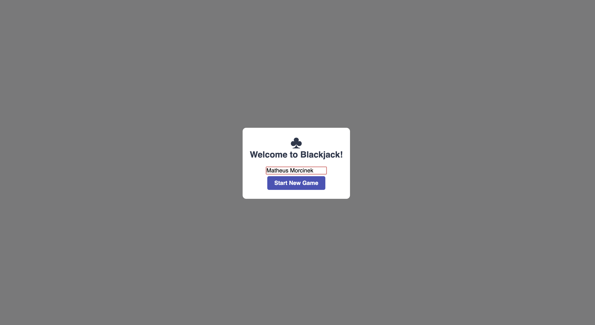
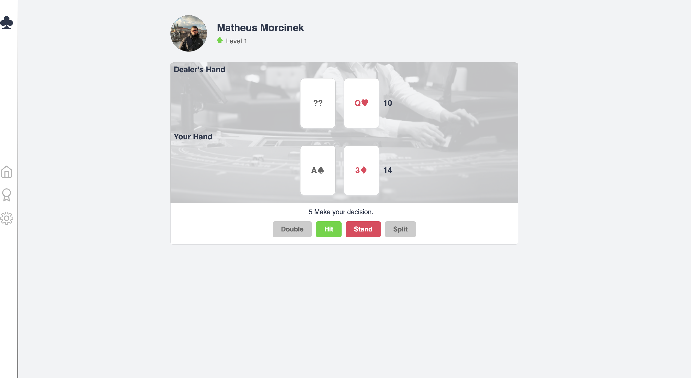
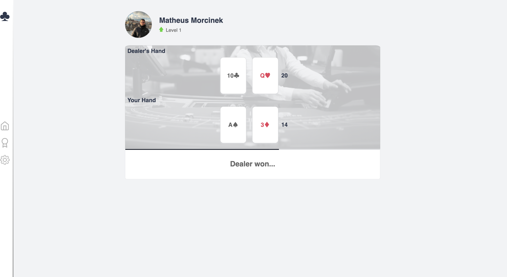

# Blackjack frontend

This React application is the frontend for the Blackjack Card Game Challenge, designed to provide a dynamic and interactive user interface for playing Blackjack directly in your web browser. The frontend communicates with a RESTful API backend to manage game logic.

## Features

Game Interface: A clean and intuitive interface that allows players to easily start new games, view their hand and the dealer's hand, and make game decisions (Hit or Stand).

Responsive Design: Crafted to provide a seamless experience across devices, ensuring that players can enjoy the game on desktops, tablets, and smartphones.

Real-time Interaction: Players can draw cards (Hit) or end their turn (Stand) with immediate feedback, enhancing the game flow and decision-making process.

Skeleton Loading: The UI employs skeleton loading screens to enhance user experience during data fetch operation or game actions, providing visual feedback that content is loading.

Winner Announcement: At the end of the game, the UI announces the winner based on the final hands and points.

Console Game Logs: For enthusiasts and developers, the game logs each match in the browser console in a structured and readable format, including the hands of both the player and the dealer.

Automatic Actions with Countdowns:

 - Player Decision Countdown: When it's time for the player to decide whether to 'Hit' or 'Stand,' a countdown timer starts. If a decision isn't made before the countdown ends, the game automatically stands for the player, moving the game forward.
 
 - Post-Game Countdown: After a game concludes and the results are displayed, a countdown timer begins, automatically starting a new game when it expires. This keeps the gameplay fluid and engaging.

## Technology Stack

React: Utilized for its component-based architecture.

CSS: For styling and responsive design, ensuring a seamless experience across different devices and screen sizes.

## Installation

Before installing, make sure you have [Node.js](https://nodejs.org/) installed. (12.x or higher)

### Getting Started

install dependencies
- npm install

start the server
- npm run dev

### UI Screenshots and Gameplay

Below are screenshots showcasing various stages of the game and features of the Blackjack Card Game interface:

Start Screen: The initial view where players can start a new game.

 -->

Gameplay Screen: Shows the player's and dealer's hands during a game.

 -->

End Game: Displays the winner and options to restart the game.

 -->

### Gameplay 

For a closer look at how the game plays out, check out this gameplay

